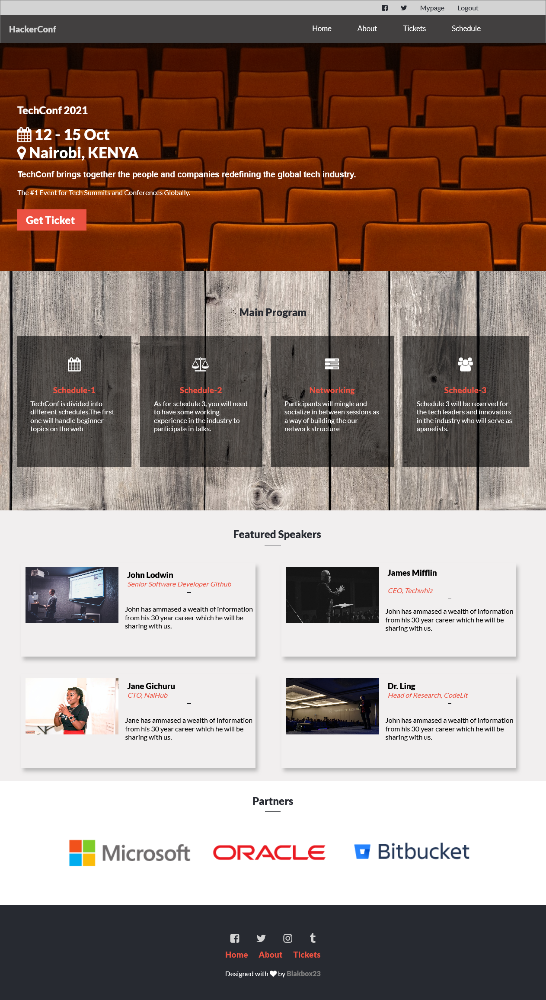
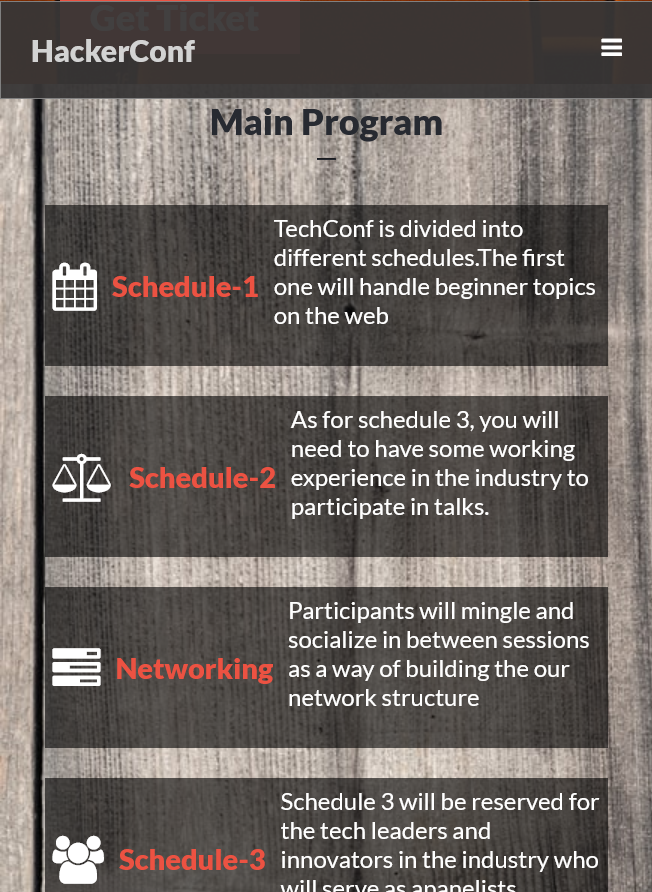

# TechConf Capstone Project
The goal of this project was to build a conference or summit website which offers information about the conference
The project requres three pages:
- Main page
- About page
- Tickets page

The project requires the site to be responsive to the different screen sizes.

## Bult With

- HTML 5
- CSS 3
- Javascript

## Live Demo

[Live Demo Link](https://blakbox23.github.io/capstone/)

## Authors
- GitHub: [@Blakbox23](https://github.com/blakbox23)
- Twitter: [@blakbox23](https://twitter.com/blakbox23)
- LinkedIn: [Peter Mbuthia](https://www.linkedin.com/in/peter-mbuthia-b15791182/)

## 🤝 Contributing

Contributions, issues, and feature requests are welcome!

Feel free to check the [issues page](https://github.com/blakbox23/NewyorkTimes/issues).

## Show your support

Give a ⭐️ if you like this project!

## Acknowledgments

- Hat tip to anyone whose code was used
- Unsplash
- Inspiration

## 📝 License

This project is [MIT](https://github.com/git/git-scm.com/blob/master/MIT-LICENSE.txt) licensed.

